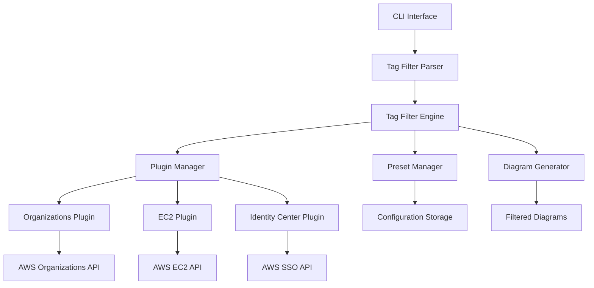

# Design Document: Tag-Based Filtering

## Overview

The tag-based filtering feature extends Reverse Diagrams with the capability to filter AWS resources based on their tags, enabling users to create focused architecture diagrams. This feature integrates seamlessly with the existing plugin architecture and provides flexible filtering options for different use cases.

## Architecture

### High-Level Architecture



### Component Interaction Flow

1. **CLI Parsing**: User provides tag filter options via command line
2. **Filter Parsing**: Tag filter parser validates and structures filter criteria
3. **Filter Engine**: Coordinates filtering across all plugins
4. **Plugin Integration**: Each plugin applies filters during data collection
5. **Relationship Preservation**: Maintains resource relationships after filtering
6. **Diagram Generation**: Creates diagrams with only filtered resources

## Components and Interfaces

### 1. Tag Filter Engine (`src/filters/tag_filter_engine.py`)

**Purpose**: Central coordinator for all tag filtering operations

**Key Methods**:
- `apply_filters(resources, filters)`: Apply tag filters to resource collections
- `validate_filters(filters)`: Validate filter syntax and logic
- `combine_filters(include_filters, exclude_filters, logic)`: Combine multiple filters
- `preserve_relationships(filtered_resources)`: Maintain resource relationships

**Interface**:
```python
class TagFilterEngine:
    def apply_filters(self, resources: List[Dict], filters: TagFilterSet) -> List[Dict]
    def validate_filters(self, filters: TagFilterSet) -> ValidationResult
    def combine_filters(self, include: List[TagFilter], exclude: List[TagFilter], logic: str) -> TagFilterSet
    def preserve_relationships(self, resources: List[Dict]) -> List[Dict]
```

### 2. Tag Filter Parser (`src/filters/tag_filter_parser.py`)

**Purpose**: Parse and validate CLI tag filter arguments

**Key Methods**:
- `parse_cli_args(args)`: Parse CLI arguments into structured filters
- `parse_tag_expression(expression)`: Parse individual tag expressions
- `validate_syntax(expression)`: Validate tag filter syntax

**Interface**:
```python
class TagFilterParser:
    def parse_cli_args(self, args: argparse.Namespace) -> TagFilterSet
    def parse_tag_expression(self, expression: str) -> TagFilter
    def validate_syntax(self, expression: str) -> bool
```

### 3. Plugin Filter Interface (`src/plugins/base.py` extension)

**Purpose**: Standardized interface for plugins to support tag filtering

**Extended Methods**:
- `supports_tag_filtering()`: Declare tag filtering capability
- `apply_tag_filters(filters)`: Apply filters during data collection
- `get_resource_tags(resource)`: Extract tags from AWS resources

**Interface Extension**:
```python
class AWSServicePlugin:
    def supports_tag_filtering(self) -> bool
    def apply_tag_filters(self, filters: TagFilterSet) -> None
    def get_resource_tags(self, resource: Dict) -> Dict[str, str]
    def filter_resources_by_tags(self, resources: List[Dict], filters: TagFilterSet) -> List[Dict]
```

### 4. Preset Manager (`src/filters/preset_manager.py`)

**Purpose**: Manage saved tag filter configurations

**Key Methods**:
- `save_preset(name, filters)`: Save filter configuration as preset
- `load_preset(name)`: Load saved filter configuration
- `list_presets()`: List available presets
- `delete_preset(name)`: Remove saved preset

**Interface**:
```python
class PresetManager:
    def save_preset(self, name: str, filters: TagFilterSet) -> bool
    def load_preset(self, name: str) -> TagFilterSet
    def list_presets(self) -> List[str]
    def delete_preset(self, name: str) -> bool
```

## Data Models

### TagFilter
```python
@dataclass
class TagFilter:
    key: str
    value: Optional[str] = None  # None for key-only filters
    operator: str = "equals"  # equals, exists, not_equals, not_exists
    
    def matches(self, resource_tags: Dict[str, str]) -> bool:
        """Check if this filter matches the given resource tags"""
```

### TagFilterSet
```python
@dataclass
class TagFilterSet:
    include_filters: List[TagFilter]
    exclude_filters: List[TagFilter]
    logic: str = "AND"  # AND, OR
    service_specific: Dict[str, List[TagFilter]] = field(default_factory=dict)
    
    def apply_to_resource(self, resource: Dict, service: str) -> bool:
        """Determine if resource should be included based on filters"""
```

### FilterResult
```python
@dataclass
class FilterResult:
    included_resources: List[Dict]
    excluded_resources: List[Dict]
    filter_stats: Dict[str, int]
    warnings: List[str]
```

## Correctness Properties

*A property is a characteristic or behavior that should hold true across all valid executions of a system-essentially, a formal statement about what the system should do. Properties serve as the bridge between human-readable specifications and machine-verifiable correctness guarantees.*

### Property Reflection

After reviewing all properties identified in the prework, several can be combined or consolidated:
- Properties 2.2 and 2.3 (AND/OR logic) can be combined into a single comprehensive logical operations property
- Properties 3.1, 3.3, and 4.1 (service-specific filtering) can be combined into a service isolation property
- Properties 5.2-5.7 (CLI parsing) can be combined into a comprehensive CLI parsing property
- Properties 8.1-8.4 (preset management) can be combined into a preset operations property

### Core Filtering Properties

**Property 1: Tag Filter Matching**
*For any* AWS resource with tags and any tag filter, the filter matching logic should correctly identify whether the resource matches the filter criteria based on key-value or key-only matching rules
**Validates: Requirements 1.1, 1.2, 1.3**

**Property 2: Logical Operations Consistency**
*For any* set of tag filters with AND or OR logic, the filtering system should include resources that match all filters (AND) or any filter (OR) consistently across all resource types
**Validates: Requirements 2.1, 2.2, 2.3**

**Property 3: Include-Exclude Filter Precedence**
*For any* combination of include and exclude filters, the system should first apply include filters then remove resources matching exclude filters, ensuring correct precedence
**Validates: Requirements 2.4**

**Property 4: Service Isolation in Filtering**
*For any* service-specific tag filter, only the specified services should have filters applied while other services include all their resources
**Validates: Requirements 3.1, 3.3, 4.1**

**Property 5: Relationship Preservation**
*For any* set of filtered resources, all relationships between the remaining resources should be preserved in the final diagram
**Validates: Requirements 1.5, 4.4**

**Property 6: Filter Validation**
*For any* tag filter input, the validation system should correctly identify valid and invalid filter syntax and provide appropriate error messages
**Validates: Requirements 2.5, 6.1, 6.4**

**Property 7: CLI Argument Parsing**
*For any* valid CLI tag filter arguments, the parser should correctly extract and structure the filter criteria into the appropriate data models
**Validates: Requirements 5.2, 5.3, 5.4, 5.5, 5.6, 5.7**

**Property 8: Performance Optimization**
*For any* tag filtering operation, filters should be applied during data collection phase to minimize API calls and processing overhead
**Validates: Requirements 7.1, 7.2, 7.3**

**Property 9: Preset Operations**
*For any* preset save/load operation, the configuration should be stored and retrieved correctly with all filter settings preserved
**Validates: Requirements 8.1, 8.2, 8.3, 8.4, 8.5**

**Property 10: Plugin Interface Consistency**
*For any* plugin that supports tag filtering, the filtering behavior should be consistent with the standardized interface across all plugins
**Validates: Requirements 10.1, 10.2, 10.3, 10.4, 10.5**

**Property 11: Empty Result Handling**
*For any* tag filter that matches no resources, the system should generate appropriate warnings and empty diagrams without errors
**Validates: Requirements 1.4, 6.2**

**Property 12: Graceful Service Degradation**
*For any* service that doesn't support tags, the filtering system should include all resources from that service and provide appropriate user feedback
**Validates: Requirements 3.5, 6.3**

## Error Handling

### Filter Validation Errors
- **Invalid Syntax**: Clear error messages with examples of correct syntax
- **Conflicting Options**: Guidance on resolving conflicting filter combinations
- **Missing Required Parameters**: Specific information about required filter components

### Runtime Errors
- **No Matching Resources**: Warning messages with applied filter details
- **Broken Relationships**: Warnings about orphaned resources in diagrams
- **Service Limitations**: Informational messages about services that don't support tags

### Performance Considerations
- **Large Resource Sets**: Progress indicators for long-running filter operations
- **API Rate Limits**: Graceful handling of AWS API throttling during filtered data collection
- **Memory Usage**: Efficient filtering algorithms for large resource collections

## Testing Strategy

### Unit Tests
- Tag filter parsing and validation
- Individual filter matching logic
- CLI argument processing
- Preset save/load operations
- Error handling scenarios

### Property-Based Tests
- **Filter Matching Consistency**: Test filter matching across various resource and tag combinations (minimum 100 iterations)
- **Logical Operations**: Verify AND/OR logic works correctly with random filter sets (minimum 100 iterations)
- **Relationship Preservation**: Ensure filtered resources maintain correct relationships (minimum 100 iterations)
- **CLI Parsing**: Test CLI argument parsing with various input combinations (minimum 100 iterations)

Each property test will be tagged with: **Feature: tag-based-filtering, Property {number}: {property_text}**

### Integration Tests
- End-to-end filtering with real AWS resource data
- Multi-service filtering scenarios
- Plugin integration with filtering capabilities
- Performance testing with large resource sets

### Edge Case Tests
- Empty filter results
- Services without tag support
- Complex filter combinations
- Invalid filter syntax handling