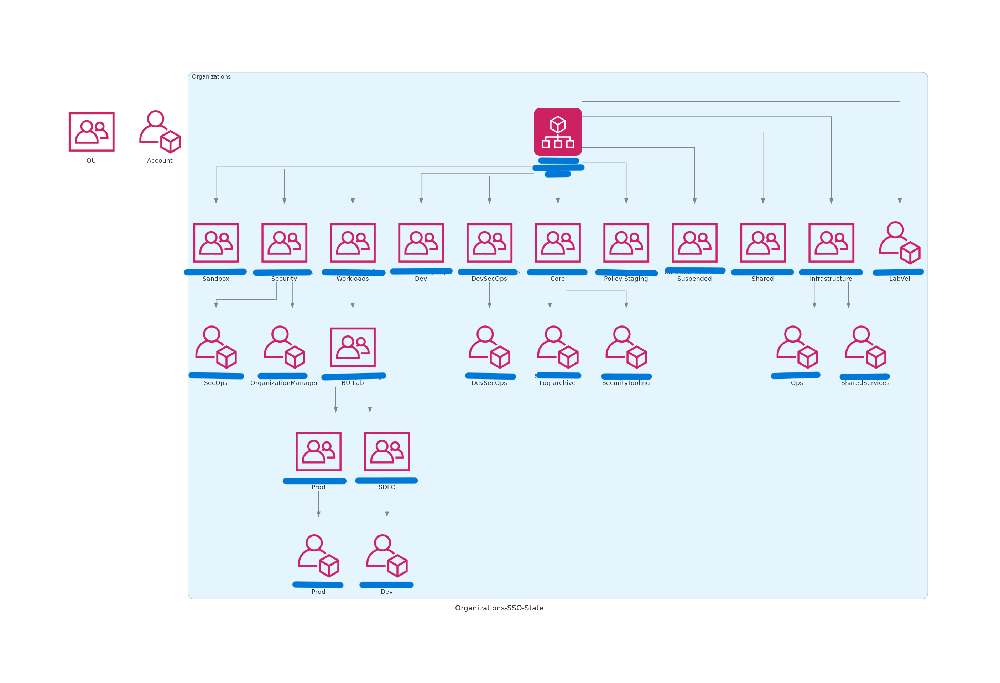

<!-- START doctoc generated TOC please keep comment here to allow auto update -->
<!-- DON'T EDIT THIS SECTION, INSTEAD RE-RUN doctoc TO UPDATE -->
**Table of Contents**  

- [Reverse Diagrams](#reverse-diagrams)
- [Install](#install)
- [Use](#use)
- [Cloud Providers](#cloud-providers)
  - [AWS](#aws)
    - [Requirement](#requirement)
    - [Service supported](#service-supported)
      - [AWS Organizations](#aws-organizations)
      - [Identity and Access Manager Center (SSO)](#identity-and-access-manager-center-sso)
  - [Additional Commands](#additional-commands)
    - [Combine the options](#combine-the-options)

<!-- END doctoc generated TOC please keep comment here to allow auto update -->

# Reverse Diagrams

> Continuous Documentation Tool - Documentation as Code Tool

This package create reverse diagrams  based on your current state in your cloud environment.

# Install 

`pip install reverse-diagrams`

# Use

The following are the available options

```commandline
$ reverse_diagrams -h 
usage: reverse_diagrams [-h] [-c CLOUD] [-p PROFILE] [-od OUTPUT_DIR_PATH] [-r REGION] [-o] [-i] [-v] [-d]

options:
  -h, --help            show this help message and exit
  -c CLOUD, --cloud CLOUD
                        Cloud Provider, aws, gcp, azure
  -p PROFILE, --profile PROFILE
                        AWS cli profile for Access Analyzer Api
  -od OUTPUT_DIR_PATH, --output_dir_path OUTPUT_DIR_PATH
                        Name of folder to save the diagrams python code files
  -r REGION, --region REGION
                        AWS cli profile for Access Analyzer Api
  -o, --graph_organization
                        Set if you want to create graph for your organization
  -i, --graph_identity  Set if you want to create graph for your IAM Center
  -v, --version         Show version
  -d, --debug           Debug Mode

```
For example: 

```commandline
reverse_diagrams -c aws -p my-profile -o -r us-east-2
Date: 2022-12-17 22:33:21.791819
❇️ Getting Organization Info
❇️ The Organizational Units list 
❇️ Getting the Account list info
✨   Run -> python3 graph_org.py 


```
Then run `python3 graph_org.py` to create a png screenshot (`organizations-state.png`) for your current state.

> Both files are saved into the current directory.

```commandline
$  reverse_diagrams -c aws -p labvel-master -o -r us-east-2
Date: 2022-12-17 22:44:07.623260
❇️ Getting Organization Info
❇️ The Organizational Units list 
❇️ Getting the Account list info
Run -> python3 graph_org.py 


$ python3 graph_org.py 
$ ls 
graph_org.py
organizations-state.png
```
For example:



Now you can edit `graph_org.py` file or add to your repositories for keeping the documentation update.


# Cloud Providers
## AWS

### Requirement

AWS programmatic access using AWS CLI. :arrow_right: [Configuring the AWS CLI](https://docs.aws.amazon.com/cli/latest/userguide/cli-chap-configure.html)

### Service supported

#### AWS Organizations

```commandline
reverse_diagrams -c aws -p my-profile -o -r us-east-2
```
#### Identity and Access Manager Center (SSO)

```commandline
reverse_diagrams -c aws -p my-profile -i -r us-east-2
```
## Additional Commands

### Combine the options

```commandline
reverse_diagrams -c aws -p my-profile -o -i -r us-east-2
```

